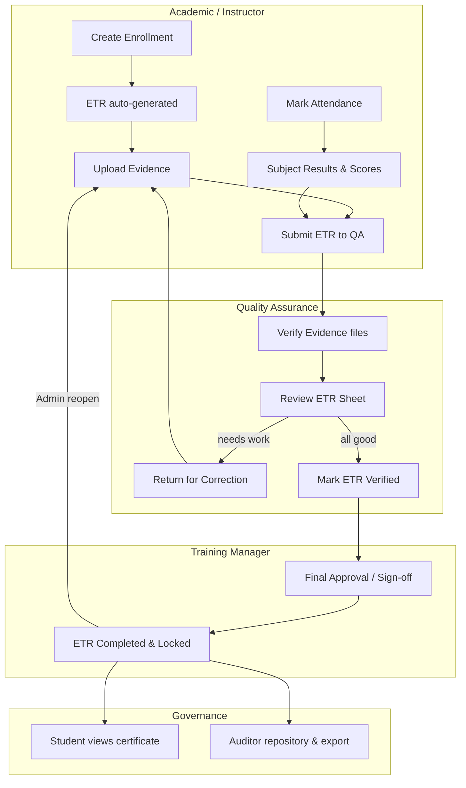
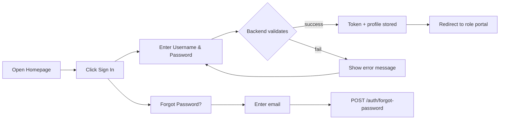
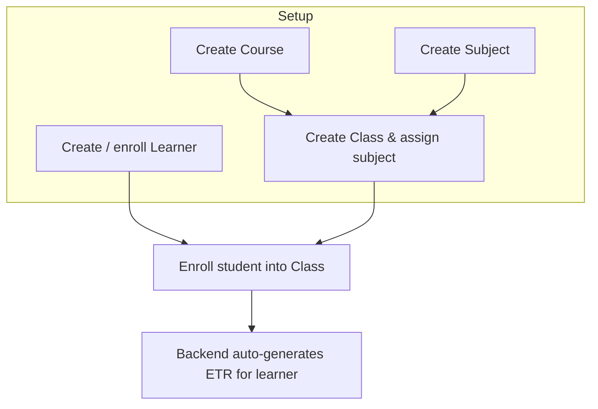
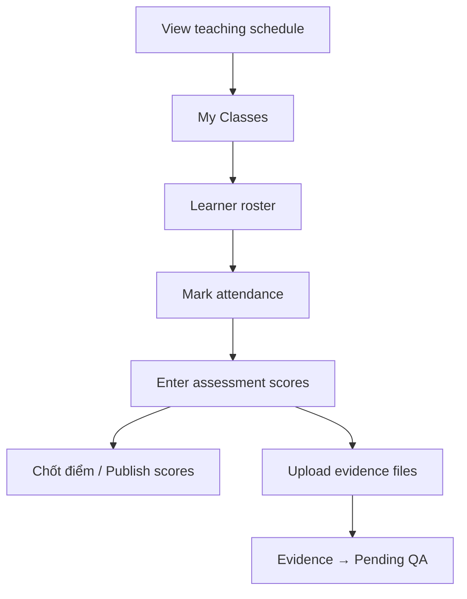
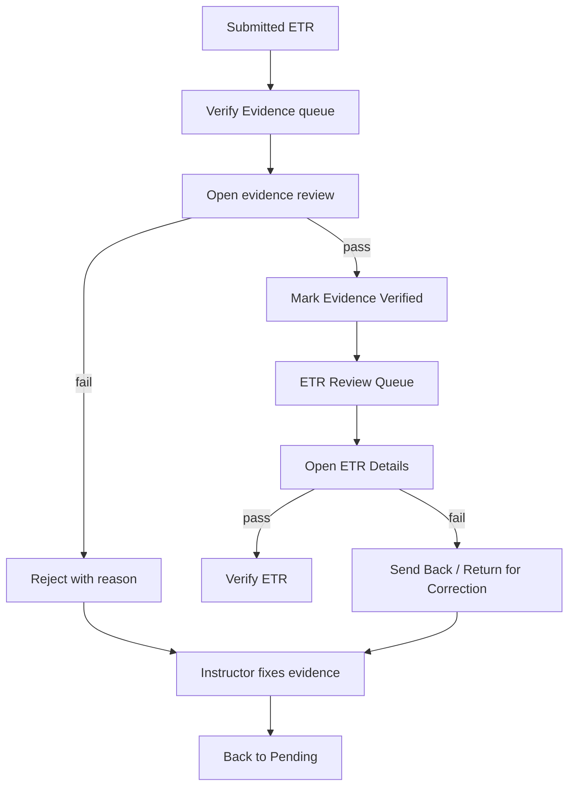
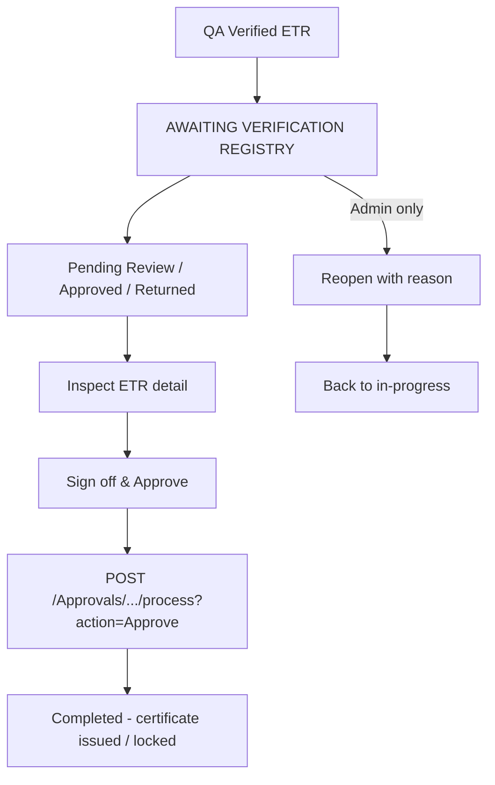
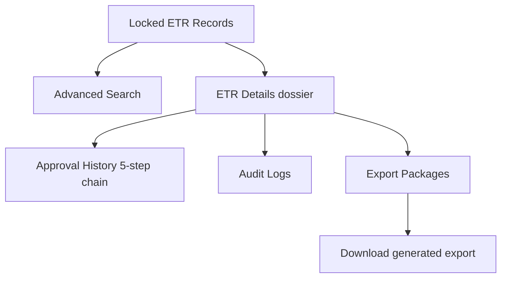

# ETR — Aviation Training Record Management System

**User Guide**

Product: AeroMetric Aviation Systems — ETR (Electronic Training Record) Platform
Version: 1.0

---

> This guide covers system requirements, installation instructions, and a complete user
> manual for every role and workflow in the ETR platform. Each workflow documents its
> purpose, a workflow diagram, and step-by-step instructions tied to the user interface.

---

# 2. Installation Guides

## 2.1 System Requirements

### Software Requirements

| Component | Requirement | Notes |
| --- | --- | --- |
| Node.js | `^20.19.0` or `>=22.12.0` | Required to run the Vite 8 development server and build tooling. Node `>=24` is also supported. |
| npm | Bundled with Node.js (`>=10`) | Package manager used to install dependencies. |
| Git | Any recent version | Required to clone the repository and to drive Vercel deployments from a git push. |
| Browser | A modern evergreen browser (Chrome, Edge, Firefox, Safari latest) | The app is built as an ESM SPA (Vite 8 target). No legacy browser support. |

### Application Configuration

| Item | Value / Notes |
| --- | --- |
| Frontend framework | React `^19.2.6` with `react-dom` |
| Build tool | Vite `^8.0.12` + `@vitejs/plugin-react` `^6.0.1` |
| Routing | `react-router-dom` `^7.18.0` |
| Styling | SCSS (`sass-embedded`), plus Tailwind via CDN (`index.html`) |
| Utilities | `react-icons`, `xlsx` (Excel parsing/preview) |
| Backend API | Deployed Azure Web App (DEPLOY-ONLY mode) |
| Data storage (browser) | `localStorage` — auth token, user profile, remembered username, language preference, per-account activity log |

### Environment Variables

The frontend reads build-time environment variables from `.env` files (`VITE_*` are public and safe to commit).

| Variable | Purpose | Example |
| --- | --- | --- |
| `VITE_API_URL_DEPLOY` | Base URL of the deployed backend API. Used for **all** requests (dev and production). | `https://etrmanagement-be-xxxxxxxx.southeastasia-01.azurewebsites.net/api` |
| `VITE_APP_TITLE` | Informational application title. | `ETR Aviation Training Portal` |
| `VITE_APP_ENV` | Informational environment label. | `development` |

> **Note:** The frontend runs in **DEPLOY-ONLY** mode. It never calls a local backend and
> does not perform any runtime fallback between environments. If `VITE_API_URL_DEPLOY` is
> missing, the code falls back to a hardcoded deployed Azure URL.

## 2.2 Installation Instruction

### Step 1 — Clone the repository

```bash
git clone <repository-url> ETR_FE
cd ETR_FE
```

### Step 2 — Install dependencies

```bash
npm install
```

This installs all runtime and development packages declared in `package.json`
(`react`, `react-dom`, `react-router-dom`, `react-icons`, `xlsx`, and dev tooling such as
Vite, Vitest, ESLint, Playwright).

### Step 3 — Configure environment

Create the environment files you need:

```bash
# Optional for local override (gitignored)
cp .env.example .env.local
# Production values (used by Vercel builds) are already committed in .env.production
```

Set `VITE_API_URL_DEPLOY` to point at your deployed backend if you are not using the
default one.

### Step 4 — Run the application

```bash
# Development server with Hot Module Replacement
npm run dev
```

The app starts a local Vite dev server (default `http://localhost:5173`). In development
the frontend still talks to the **deployed Azure backend** — no local backend is required.

### Step 5 — Build for production

```bash
npm run build
```

- Produces an optimized bundle under `dist/`.
- In production mode (`import.meta.env.PROD`), the app uses the API URL from
  `VITE_API_URL_DEPLOY` defined in `.env.production`.

Preview the production build locally:

```bash
npm run preview
```

### Step 6 — Lint and test (optional)

```bash
# ESLint over the whole project
npm run lint

# Production build + E2E user-flow test (Playwright)
npm run build
npm run test:e2e
```

Unit tests live under `src/test/` and can be run with Vitest:

```bash
npx vitest run
```

### Step 7 — Deploy to Vercel

1. Connect the repository to a Vercel project.
2. Build command: `npm run build` • Output directory: `dist`.
3. `vercel.json` contains the SPA rewrite `{"source": "/(.*)", "destination": "/index.html"}`
   so deep links and page refreshes route correctly through `react-router`.
4. Every push to the linked branch triggers a production build, which picks up
   `VITE_API_URL_DEPLOY` from the committed `.env.production`.

---

# 3. User Manual

## 3.1 Overview

### What is the ETR Platform?

The **ETR (Electronic Training Record)** platform centralizes the entire aviation training
record lifecycle in one secure, role-based application. It replaces paper-based training
records with a digital dossier that moves through controlled approval stages — from
enrollment and evidence collection, to quality-assurance verification, to final
management sign-off, and finally into a locked, audit-ready compliance repository.

The system is used by seven distinct user roles, each with its own portal:

| Role | Portal URL | Responsibility |
| --- | --- | --- |
| Admin | `/admin` | User, department, audit and system configuration management |
| Academic | `/academic` | Learners, courses/classes, subjects, ETR workflow management, expiring certificates |
| Instructor | `/instructor` | Class rosters, attendance, assessments, evidence upload, teaching schedule |
| QA (Quality Assurance) | `/qa` | Evidence verification, ETR review queue, returns, audit trail |
| Training Manager | `/trainingmanager` | Analytics dashboard, ETR final approval, class status, expiring certificates |
| Student | `/student` | Personal overview, own ETR dossier, certificates, profile |
| Auditor | `/auditor` | Read-only compliance repository, advanced search, approval history, export packages |

> Admin accounts can also enter the Training Manager portal (`/trainingmanager`) to approve
> or reopen ETRs.

### Authentication Model

- Login is performed via `POST /auth/login` with a username and password. The backend returns
  a JWT token plus the user profile. **No demo accounts exist** — all credentials and data
  come from the real API.
- The token and user profile are stored in `localStorage`. After a successful login the user
  is redirected to their role portal.
- Sessions are protected by:
  - Route guards (`ProtectedRoute`) that check token presence and role membership;
  - Automatic expiry checks every 5 seconds and on window focus;
  - `401/403` handling that clears the session and sends the user back to `/login`;
  - A 20-second request timeout on API calls (12 seconds on login).
- The interface supports full **bilingual switching** (Vietnamese ↔ English) via the language
  toggle in the top bar of every portal.

### Global Interface

Every role portal shares the same shell:

- **Sidebar navigation** — role-specific menu (Dashboard + feature pages) with a brand block.
- **Top bar** — back button, breadcrumb, notifications bell (per-account activity log of
  write operations) and the language switcher.
- **Content area** — the active page rendered by `react-router`.
- **Log out** — button at the bottom of every sidebar; clears the session and returns to login.

### End-to-End Feature Workflow

The diagram below summarizes how a record moves through the whole platform across roles.



### The ETR Status Lifecycle

An ETR moves through the following statuses:

| API Status | Portal Label | Meaning |
| --- | --- | --- |
| `Draft` / `InProgress` / `Active` / `Reopened` | UNDER REVIEW | Record in progress; evidence being collected |
| `Submitted` | PENDING QA | Sent to QA; creates an Approval Request |
| `Verified` | QA VERIFIED | QA reviewed and verified the full ETR |
| `ReturnedForCorrection` | RETURNED FOR CORRECTION | Sent back to the training team with a reason |
| `Completed` | APPROVED | Final approval done; record is locked (`IsLocked = true`) |

Each submission to QA creates a **new** Approval Request; a record that is returned and
resubmitted receives a fresh request. The most recent request determines the current state.

---

## 3.2 Workflow — Login & Account Access

### Purpose

Provide every user with secure, role-aware entry to the platform and a mechanism to
recover a forgotten password.

### Workflow Diagram



### Detailed Guide

#### Logging in

1. Open the application URL (production domain or `http://localhost:5173` in development).
2. From the public landing page, click **Sign In** (top-right) to open the login page.
3. Enter your **Username** (minimum 3 characters) and **Password** (minimum 6 characters).
4. Optionally tick **Remember me** to pre-fill your username on the next visit.
5. Click **Sign In**.

The system calls `POST /auth/login`. On success:

- The JWT and your profile (account id, username, full name, role) are saved to `localStorage`;
- You are redirected automatically to your role portal (see the redirect table in 3.1).

If the server responds with an error, the message is displayed under the form. If the
backend cannot be reached, a connection error is shown — check your network or the API
configuration.

#### Recovering a forgotten password

1. Click **Forgot Password** on the login page.
2. Enter the email address registered to your account.
3. Click **Send**. The system calls `POST /auth/forgot-password` and displays a success or
   failure message inline.

#### Logging out

Click **Đăng xuất / Sign Out** at the bottom of the sidebar in any portal. The token and
profile are removed from `localStorage` and you are returned to `/login`.

#### Session expiry

If your token expires, the application automatically clears the session and returns you to
the login screen (checked every 5 seconds and whenever the window regains focus). Any `401`
response also triggers sign-out so you can re-authenticate.

---

## 3.3 Workflow — Learner, Course & Class Management (Academic / Admin)

### Purpose

Let Academic staff (and, where relevant, Admin) build the training structure the ETR system
depends on: learners, courses, classes, subjects and enrollments. Creating an enrollment is
what triggers the automatic creation of a learner's ETR.

### Workflow Diagram



### Detailed Guide

#### Managing learners (Academic)

1. From `/academic`, open **HỌC VIÊN (Learners)** from the sidebar.
2. Use the **search box** and filters (status, class) to locate learners.
3. Use row actions to **view profile**, **edit** learner details, or open the **enroll**
   dialog to place a student into a class.

#### Managing courses & classes

1. Open **KHÓA & LỚP HỌC (Courses & Classes)**.
2. On the **Course** side, use **Create Course** (name, code, description).
3. On the **Class** side, use **Create Class** (class id, name, subject, dates, room,
   trainee count, class type).
4. Use **Enroll Students** to add learners to a class, and **Update Class Status** to
   manage the class lifecycle. Attendance history is available per class.

#### Managing subjects

1. Open **CHỦ ĐỀ MÔN HỌC (Subjects)**.
2. Use **Add / Edit** to define subject name, code, and pass score.

#### Resulting ETR creation

When a learner is enrolled, the backend automatically generates an **ETR** for them. The
"TẠO MỚI ETR (New ETR)" button in ETR management is effectively a lookup + refresh of this
auto-generated record — the ETR content is driven by enrollment, attendance, results and
evidence.

---

## 3.4 Workflow — Instructor: Classes, Attendance, Assessments & Evidence

### Purpose

Give instructors everything they need to run a class end-to-end: see their rosters, mark
attendance, record assessment scores, lock scores, and collect the evidence attached to a
learner's ETR.

### Workflow Diagram



### Detailed Guide

#### Viewing my classes & schedule

1. Open **BẢNG ĐIỀU KHIỂN (Dashboard)** for a summary of your classes, students, sessions
   and pending grades.
2. **LỚP CỦA TÔI (My Classes)** lists your assigned classes with learner rosters and
   shortcuts to attendance, assessments and evidence.
3. **LỊCH GIẢNG DẠY (Schedule)** shows the teaching calendar.

#### Marking attendance

1. Open **ĐIỂM DANH (Attendance)**.
2. Select the class and the session.
3. Toggle each learner as **Present / Absent**.
4. Click **Save**. Attendance is pushed to the backend and contributes to each learner's
   ETR attendance rate (the ETR completeness checklist requires **≥ 80%** attendance per
   subject).

#### Recording assessments & publishing scores

1. Open **ĐÁNH GIÁ (Assessments)**.
2. Select the subject/class and enter each learner's score against the pass score.
3. Click **Save**.
4. When confident, **Chốt điểm / publish** the assessment and practical checklist results
   (`isPublished = true`). The ETR checklist only marks the *results* step complete when all
   results are published.
5. **CẤU TRÚC ĐÁNH GIÁ (Assessment Structure)** is a read-only view of components, weights
   and pass criteria.

#### Uploading evidence

1. Open **MINH CHỨNG (Evidence)**.
2. Select the **Class**, then the **Learner** and the **Evidence Type**.
3. Drag-and-drop (or pick) files — supported PDF/PNG/JPG/DOCX, max 10 MB.
4. Click **Upload**. The file is attached to the learner's subject result and enters
   **Pending** status, awaiting QA verification.
5. Delete files that are not yet Verified; rejected files display the QA reason and can be
   corrected and re-uploaded.

---

## 3.5 Workflow — Academic: ETR Management & Submission to QA

### Purpose

Let Academic staff monitor every ETR, manage its evidence, check the 4-step completeness
checklist, and submit verified-ready records to QA.

### Completeness Checklist

1. **Personal info** — always verified.
2. **Attendance** — complete when every subject result has `attendanceRate >= 80`.
3. **Test results** — complete when every assessment and practical checklist result is
   published (Chốt điểm).
4. **Evidence** — complete when every evidence file for the ETR is `Verified`.

### Detailed Guide

1. Open **QUẢN LÝ ETR (ETR Management)** from the Academic sidebar.
2. Use the **search box** and the **status filter** (ALL / APPROVED / PENDING QA / UNDER
   REVIEW / RETURNED FOR CORRECTION) to scan records.
3. Review the **TIẾN ĐỘ HỒ SƠ ETR** (workflow progress) card to see which of the four
   checklist steps are complete for a selected record.
4. Use **MINH CHỨNG (Evidence)** to open the evidence manager:
   - Filter by file category (TẤT CẢ / HÌNH ẢNH / PDF / CHỮ KÝ SỐ) or by file name;
   - Preview files, view QA status badges (Verified / Pending QA / Rejected) with reasons;
   - Delete non-Verified evidence or upload new evidence;
   - A warning banner appears if the account is not permitted to read `/Evidences`.
5. When all evidence is Verified **and** attendance/results are complete, click
   **SUBMIT ETR** (green button — enabled only when the checklist is ready). This changes the
   status to **PENDING QA** and creates an Approval Request for QA.
6. Use **VIEW FINAL** to open the ETR Final Sheet ("ELECTRONIC TRAINING RECORD") for a
   printable recap.

The **Audit Trail** table at the bottom logs all changes (time, actor, action, content).

---

## 3.6 Workflow — QA: Evidence Verification, ETR Review & Returns

### Purpose

Give QA staff the tools to validate evidence integrity, review full ETR dossiers before
acceptance, return incomplete records for correction, and keep an immutable audit trail.

### Workflow Diagram



### Detailed Guide

#### Verifying evidence

1. From the QA portal open **VERIFY EVIDENCE** (Dashboard group).
2. The **Pending Evidence (n)** queue lists files awaiting review. Use **Review** to open the
   full-screen preview modal (image/PDF preview + metadata: learner, file, uploaded time,
   size, type, subject result).
3. Click **Verify** to approve the evidence, or **Reject** (a reason is required) to send it
   back.
4. Records belonging to completed/locked ETRs are marked **🔒 ETR Locked** — verify/reject
   actions are hidden for them.

#### Reviewing ETRs

1. Open **ETR REVIEW QUEUE**.
2. The **Submitted ETRs (n)** queue lists records awaiting your review. Select one to reveal
   **View Details / Verify ETR / Return for Correction**.
3. **View Details** opens the full ETR sheet: learner, course, the 4-step checklist, per-
   subject breakdown (attendance, signed-off results, assessment scores, evidence with
   verification status) and the approval history.
4. Click **Verify ETR** to accept the record (status becomes **QA VERIFIED** and it moves to
   the Training Manager queue).
5. Click **Return for Correction** to send it back — a reason is required.

#### Returning records (dedicated page)

1. Open the **Return** flow (reachable from the review queue).
2. In **Select ETR**, choose a Submitted/Draft record.
3. Pick a **Common Return Reason** chip (e.g., Missing evidence file, Attendance record
   incomplete, Assessment not attached, Wrong learner details) or type a custom reason.
4. Click **Send Back**. The record returns to the training team for correction.

#### Search, audit trail & retake history

- **SEARCH ETR RECORDS** — advanced search with PDF/CSV export.
- **VIEW AUDIT TRAIL** — immutable log of QA actions (who verified/rejected, timestamps).
- **RETAKE HISTORY** — retake/retest history per learner/subject.

---

## 3.7 Workflow — Training Manager: ETR Final Approval

### Purpose

Provide final authority sign-off on QA-verified records. This is the last approval gate
before an ETR becomes a permanent, locked certificate record.

### Workflow Diagram



### Detailed Guide

#### Analysing the dashboard

1. **ANALYTICS DASHBOARD** shows the ETR approval funnel, completion statistics and
   expiring-certificate alerts (total trainees, pending ETRs, approvals, compliance/completion
   rate, certifications due, submission-progress chart).

#### Approving ETRs

1. Open **ETR FINAL APPROVAL** (`/trainingmanager/etr-approval`).
2. Use the tabs **Pending Review (n) / Approved (n) / Returned (n)** to filter the registry.
3. Review the metrics row (total pending, avg. processing time, active classes, avg.
   attendance, near-completion count) and the **AWAITING VERIFICATION REGISTRY** table
   (ETR ID, personnel, course/module, status badge, actions).
4. Click **HISTORY** to open the inspect modal (trainee info, assessment scores, QA
   Verification Log with **QA STAMPED**, return feedback or approved log).
5. For a pending record, click **APPROVE ETR**.
6. Confirm with **Sign off & Approve**. The system calls the Approval Request process
   endpoint, which stamps the certificate, issues the final approval key, updates the audit
   log, and locks the record (status **APPROVED / Completed**, `IsLocked = true`).

#### Reopening a completed record (Admin only)

1. In the **Approved** tab, Admin accounts see a **REOPEN** action.
2. Click **REOPEN**, enter the reason in the prompt modal, and confirm. The ETR returns to
   in-progress so corrections can be applied and it can be resubmitted.

#### Class status & expiring certificates

- **TRẠNG THÁI LỚP HỌC (Class Status)** — class progress overview.
- **CHỨNG CHỈ HẾT HẠN (Expiring Students)** — learners whose certificates expire within a
  window.

---

## 3.8 Workflow — Student: View ETR, Certificates & Profile

### Purpose

Give learners read-only visibility of their own training records, certificate status and
personal profile — and a place to change their password.

### Detailed Guide

#### Overview

**TỔNG QUAN (Dashboard)** shows the student's enrolled classes, ETR status summary,
certificate expiries and upcoming sessions.

#### My ETR

1. Open **HỒ SƠ ETR (My ETR)**.
2. Use the tabs **Danh sách ETR** (list of records) and **Lịch sử đào tạo** (training history
   timeline).
3. Click **Chi tiết** on a record to view: record info (issue/expiry dates, previous ETR),
   the subject results table (theory score, practical score, attendance, PASS/FAIL), evidence
   chips, and the audit trail.
4. Completed records are marked **completed & permanently locked (đã hoàn thành và khóa vĩnh
   viễn)**.

#### Certificates

**CHỨNG CHỈ (Certificates)** lists the learner's certificate status with validity/expiry
badges and download options.

#### Profile

**HỒ SƠ CỦA TÔI (My Profile)** shows the learner's details and a **change-password** form.

---

## 3.9 Workflow — Auditor: Compliance Repository, Search & Export

### Purpose

Provide an independent, **read-only** compliance view for auditors: browse the locked ETR
repository, run advanced searches, verify approval chains, inspect audit logs, and export
regulatory packages. No write actions are exposed.

### Workflow Diagram



### Detailed Guide

#### Dashboard

**DASHBOARD** shows KPIs (total locked records, compliance rate, pending audit, packages
exported) plus recently locked records, recent audit events and recent export history.

#### Browsing locked records

1. Open **LOCKED ETR RECORDS**.
2. Search by text and filter by category chip (Line Maintenance / Flight Operations /
   Quality Assurance / Base Maintenance).
3. The table lists ETR ID, learner, course, completion date, locked date, approved-by and a
   **Locked & Compliant** status. Use row actions for **View Details**, **Approval History**
   or **Export**.

#### Advanced search

**ADVANCED SEARCH** lets you combine parameters (learner, course, class, ETR ID, completion
date, locked date, lock status) and reset to start over.

#### ETR details dossier

**ETR DETAILS** presents a six-tab dossier: Learner Information, Attendance, Assessment
Results, Training Evidence (with **SHA-256 VERIFIED MATCH** display), Approval History
(timeline with hashes) and Audit Trail. Use **Export Dossier PDF** for a printable copy.

#### Approval history

**APPROVAL HISTORY** shows the 5-step approval sequence banner
(**Academic → QA → Training Manager → System Locked → Audited**) plus the detailed execution
log timeline with cryptographic signatures.

#### Audit logs

**AUDIT LOGS** is an immutable audit trail with search and module filters (ETR Inspection,
Export Packages, Security Enforcer, ETR Workflow, QA Verification, Advanced Search). Results
flagged `FORBIDDEN` are highlighted.

#### Export packages

**EXPORT PACKAGES** offers four export types:

1. **PDF dossier** — printable ETR dossier.
2. **Evidence ZIP** — bundle of verified evidence files.
3. **Regulatory / CAA-EASA package** — compliance submission package.
4. **Digital Signature manifest (`.p7b`)** — cryptographic signature manifest.

Select an export, generate it, and download the completed package from the export history.

---

## Appendix A — API Endpoint Reference (main routes)

| Action | Endpoint | Method |
| --- | --- | --- |
| Login | `/auth/login` | POST |
| Forgot password | `/auth/forgot-password` | POST |
| List ETRs | `/Etr` | GET |
| ETR detail | `/Etr/{id}` | GET |
| Submit ETR to QA | `/Etr/{id}/submit` | POST |
| QA verify ETR | `/Etr/{id}/verify` | POST |
| QA return ETR | `/Etr/{id}/return` | POST |
| Complete ETR (fallback) | `/Etr/{id}/complete` | POST |
| Reopen ETR (Admin) | `/Etr/{id}/reopen` | POST |
| Student own ETRs | `/Etr/my-etr` | GET |
| Student training history | `/Etr/student/{accountId}/history` | GET |
| List evidence | `/Evidences` | GET |
| Upload evidence | `/Evidences/upload` | POST |
| Verify/reject evidence | `/Evidences/{id}/verify` | PUT |
| Download evidence | `/Evidences/{id}/download` | GET |
| Approval requests | `/Approvals` | GET |
| Approve ETR | `/Approvals/{approvalRequestId}/process?action=Approve` | POST |
| Audit log | `/Audit`, `/Audit/{id}`, `/Audit/search?query=` | GET |
| Auditor exports | `/Exports/pdf`, `/Exports/training-package`, `/Exports/dashboard`, `/Exports/download/{id}` | POST/GET |

## Appendix B — System Administration (Admin portal)

| Page | Description |
| --- | --- |
| **DASHBOARD** | System overview with KPI cards and user/class/ETR tables |
| **USER MANAGEMENT** | Create/edit/delete user accounts, assign roles, search |
| **DEPARTMENT MANAGEMENT** | Manage departments (e.g., Line Maintenance, Flight Operations, QA, Base Maintenance) |
| **AUDIT LOG** | System audit trail of user actions |
| **SYSTEM CONFIG** | Global settings: system name, thresholds, exam pass score, ETR validity days, security options |